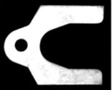

# shape_based_matching  

update:   
**[fusion implementation to run faster!](https://github.com/meiqua/shape_based_matching/issues/77)**  
**[icp is also refined to be faster and easier to use](https://github.com/meiqua/shape_based_matching/issues/100)**  

[Transforms in shape-based matching](./Transforms%20in%20shape-based%20matching.pdf)  
[pose refine with icp branch](https://github.com/meiqua/shape_based_matching/tree/icp2D), 0.1-0.5 degree accuracy   
[icp + subpixel branch](https://github.com/meiqua/shape_based_matching/tree/subpixel), < 0.1 degree accuracy  
[icp + subpixel + sim3(previous is so3) branch](https://github.com/meiqua/shape_based_matching/tree/sim3), deal with scale error  

try to implement halcon shape based matching, refer to machine vision algorithms and applications, page 317 3.11.5, written by halcon engineers  
We find that shape based matching is the same as linemod. [linemod pdf](Gradient%20Response%20Maps%20for%20Real-TimeDetection%20of%20Textureless%20Objects.pdf)  

halcon match solution guide for how to select matching methods([halcon documentation](https://www.mvtec.com/products/halcon/documentation/#reference_manual)):  
  

## steps

1. change test.cpp line 9 prefix to top level folder

2. in cmakeList line 23, change /opt/ros/kinetic to somewhere opencv3 can be found(if opencv3 is installed in default env then don't need to)

3. cmake make & run. To learn usage, see different tests in test.cpp. Particularly, scale_test are fully commented.

NOTE: On windows, it's confirmed that visual studio 17 works fine, but there are some problems with MIPP in vs13. You may want old codes without [MIPP](https://github.com/aff3ct/MIPP): [old commit](https://github.com/meiqua/shape_based_matching/tree/fc3560a1a3bc7c6371eacecdb6822244baac17ba)  

## thoughts about the method

The key of shape based matching, or linemod, is using gradient orientation only. Though both edge and orientation are resistant to disturbance,
edge have only 1bit info(there is an edge or not), so it's hard to dig wanted shapes out if there are too many edges, but we have to have as many edges as possible if we want to find all the target shapes. It's quite a dilemma.  

However, gradient orientation has much more info than edge, so we can easily match shape orientation in the overwhelming img orientation by template matching across the img.  

Speed is also important. Thanks to the speeding up magic in linemod, we can handle 1000 templates in 20ms or so.  

[Chinese blog about the thoughts](https://www.zhihu.com/question/39513724/answer/441677905)  

## improvment

Comparing to opencv linemod src, we improve from 6 aspects:  

1. delete depth modality so we don't need virtual func, this may speed up  

2. opencv linemod can't use more than 63 features. Now wo can have up to 8191  

3. simple codes for rotating and scaling img for training. see test.cpp for examples  

4. nms for accurate edge selection  

5. one channel orientation extraction to save time, slightly faster for gray img

6. use [MIPP](https://github.com/aff3ct/MIPP) for multiple platforms SIMD, for example, x86 SSE AVX, arm neon.
   To have better performance, we have extended MIPP to uint8_t for some instructions.(Otherwise we can only use
   half feature points to avoid int8_t overflow)  

7. rotate features directly to speed up template extractions; selectScatteredFeatures more 
evenly; exautive select all features if not enough rather than abort templates(but features <= 4 will abort)

## some test

### Example for circle shape  

#### You can imagine how many circles we will find if use edges  

  

#### Not that circular  

  

#### Blur  

  

### circle template before and after nms  

#### before nms


#### after nms

  

### Simple example for arbitary shape

Well, the example is too simple to show the robustness  
running time: 1024x1024, 60ms to construct response map, 7ms for 360 templates  

test img & templ features  
  
  


### noise test  

  

## some issues you may want to know  
Well, issues are not clearly classified and many questions are discussed in one issue sometimes. For better reference, some typical discussions are pasted here.  

[object too small?](https://github.com/meiqua/shape_based_matching/issues/13#issuecomment-474780205)  
[failure case?](https://github.com/meiqua/shape_based_matching/issues/19#issuecomment-481153907)  
[how to run even faster?](https://github.com/meiqua/shape_based_matching/issues/21#issuecomment-489664586)  

このrepoを動かしてみる

https://github.com/meiqua/shape_based_matching

- 1. docker kinetic image 実行

docker ros kinetic https://qiita.com/seigot/items/9a3a101dbbd7828ee00b

```
docker run -it --rm -p 6080:80 ct2034/vnc-ros-kinetic-full
docker run -it --rm -p 6080:80 ct2034/vnc-ros-kinetic-full/shape-based-matching:0.0.3
```

- commit 

```
docker commit {ps id} ct2034/vnc-ros-kinetic-full/shape-based-matching:0.0.3
```

ryodoさんの https://github.com/RyodoTanaka/ubuntu

http://127.0.0.1:6080/ にアクセス

- 2. その中にcloneしてtest.cppのテストフォルダへのパスを修正　ビルド&実行
- 3. 結果


test.cppに3種類のサンプルがあるみたい


上の写真は,angle_test()関数

- scale_test()実行結果


- noise_test()実行結果


- angle_test() : モードを"test"じゃなくしてみる  ※ 引数を ("test", True)　から ("train", True)に変更

結果


- scale_test()でモードをtestからtrainに変更

以下のような出力がされた

```
empl_id: 0
templ_id: 1
have no enough features, exaustive mode
templ_id: 2
have no enough features, exaustive mode
templ_id: 3
templ_id: 4
templ_id: 5
templ_id: 6
templ_id: 7
templ_id: 8
templ_id: 9
...
```

- noise_test() testからtrainに変更

結果


# プログラム中身

## angle_test()内のtestモード内部

```
       std::cout << "train end" << std::endl << std::endl;
    }else if(mode=="test"){
        std::vector<std::string> ids;
        ids.push_back("test");
        detector.readClasses(ids, prefix+"case1/%s_templ.yaml");

        // angle & scale are saved here, fetched by match id
        auto infos = shape_based_matching::shapeInfo_producer::load_infos(prefix + "case1/test_info.yaml");

        Mat test_img = imread(prefix+"case1/test.png");
        assert(!test_img.empty() && "check your img path")
```

yamlファイルを呼び出している. => template形状などyamlファイルに保存してあるみたい  

- info


- templ


以下で形状マッチを実施しているみたい

```
        auto matches = detector.match(img, 90, ids);
```

このdetectorクラスは以下のように生成され処理されている.テンプレート形状を内部に持っている.

```
    line2Dup::Detector detector(128, {4, 8});
      detector.readClasses(ids, prefix+"case1/%s_templ.yaml");
```

- 画像を変えてみる


angle_test()の画像を変更

train.pngを


test.pngを


プログラムを以下のように変更


trainモードで形状データセット作成 => testモードでマッチング処理実行  

結果


探索できた...  
探索にかかった時間は以下のように,z全体で0.2sくらい,すごい...  

```
construct response map
elasped time:0.0653973s

templ match
elasped time:0.0182259s


elasped time:0.0861984s
matches.size(): 41

match.template_id: 0
match.similarity: 100
```

test.pngを変えてみた  
結果


いい感じ...


ちなみにtrain画像作成のためにクロップするのは,webのpng画像クリップツールを使用: https://www.iloveimg.com/crop-image/crop-png

```
sudo docker run -it --rm -p 6080:80 ct2034/vnc-ros-kinetic-full/shape-based-matching:0.0.1
```

test , train分離したらできた!


# docker 

タブ補間効かない

https://engineer-ninaritai.com/linux-complement/

```
sudo apt-get install bash-completion
```

# 複数認識

top5の値を変えてあげる


# 次やること

- rostopicで認識位置・回転角度を出力
- 実際のネジなどで試してみる

# hostpc-docker分離

アルゴリズムのみdockerに分離,.bashrcないでhostpcとdocker間の通信が必要: (参照) https://qiita.com/hoshianaaa/items/300bf653c33fa3f0ea4a の`dockerとhost pc間`

- hostpc

```
cd ~/shape_based_matching
bash start.sh
```

- docker

```
cd ~/shape_based_matching
bash start2.sh
```

# docker 自動起動

`docker_run.sh.desktop`という名前のファイルを作成`~/.config/autostart`に置く

```
[Desktop Entry]
Type=Application
Exec=gnome-terminal -- bash -c "docker run -it --rm -p 6080:80 ct2034/vnc-ros-kinetic-full; exec bash"
Hidden=false
NoDisplay=false
X-GNOME-Autostart-enabled=true
Name[en_US]=start-slam
Name=start-slam
Comment[en_US]=start slam application.
Comment=start slam application.
```

## docker image作成

```
FROM ros:kinetic
# install ros tutorials packages
RUN apt-get update
RUN apt-get install -y ros-kinetic-cv-bridge \
    ros-kinetic-image-transport \
    && rm -rf /var/lib/apt/lists/
RUN git clone https://github.com/hoshianaaa/shape_based_matching.git
RUN cd shape_based_matching \
   &&  mkdir build \
   &&  cd build \
   &&  cmake .. \
   &&  make
```

- docker file build

```
docker image build -t shape_based_matching .
```

docker image 実行 && shape_based_matching実行

```
docker run -it --rm shape_based_matching bash shape_based_matching/run
```

```
    1  sudo apt update
    2  cd
    3  sudo apt install ros-kinetic-cv-bridge
    4  sudo apt install ros-kinetic-cv-bridge -y
    5  his
    6  history 
    7  sudo apt install git -y
    8  git clone https://github.com/hoshianaaa/shape_based_matching.git
    9  ls
   10  cd shape_based_matching/
   11  mkdir build 
   12  cd build/
   13  cmake ..
   14  sudo apt install ros-kinetic-image-transport
   15  make
   16  ls
   17  cmake ..
   18  make
   19  history 
   20  ls
   21  ./shape_based_matching_test 
   22  cd ..
   23  source in_bashrc.sh 
   24  ./build/shape_based_matching_test 
   25  ls
   26  clear
   27  history 

```
